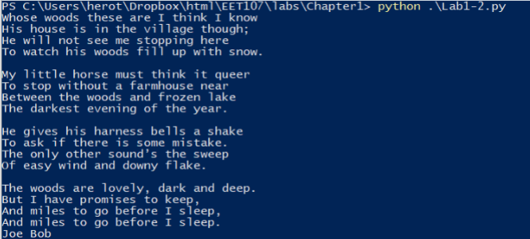

## Chapter 1 - Lab 1

### Instructions:
- Use an Internet search engine to find a poem containing at least six lines 
- Create a Python program named Lab1.py that uses Python to output the poem on the screen 
- Add a line to the end of the program that prints your first and last name
- Upload your code to the assignment repo. (add, commit and push)

### Sample Output

### Grading:
General, compiles, comments, proper indentation, etc  
Correct file name  
Program produces the proper output
